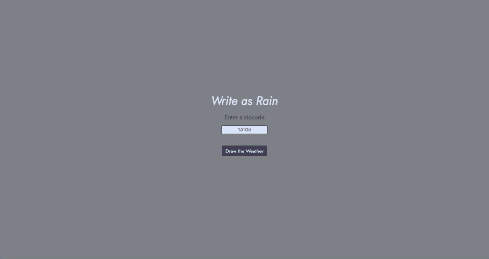
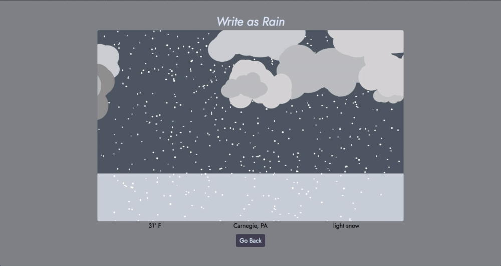
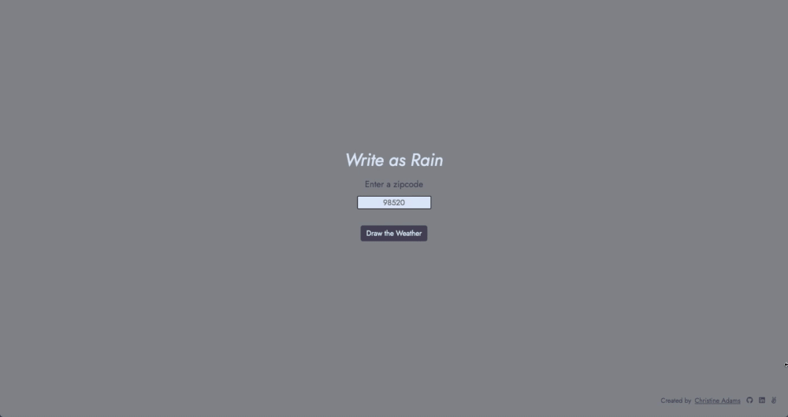
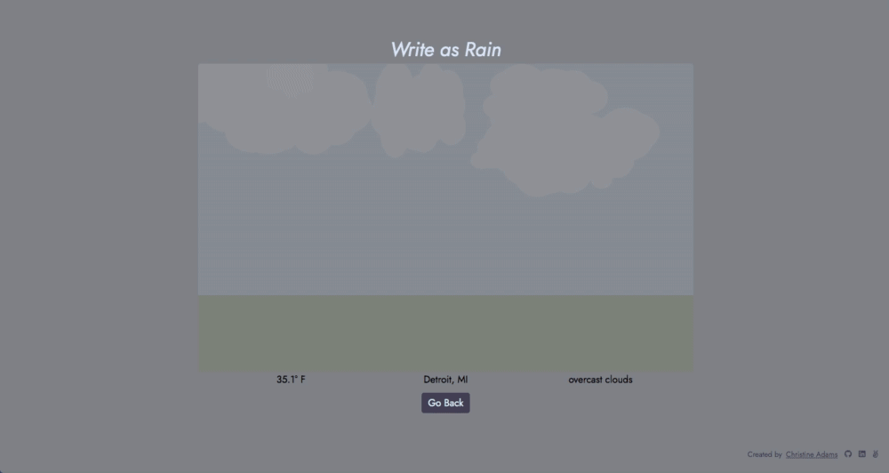

# Write As Rain

## Description: 

Write as Rain is a web app that draws the weather. Check out the live site [here](https://write-as-rain.herokuapp.com/)!

## Technology:
This app was created with JavaScript and utilizes the p5.js library to produce Canvas animations. Write as Rain is integerated with the Weatherbit.io API to fetch current weather data, and the app includes a lightweight Node.js backend with Express to securely fetch API data.

## Features:
Users are able to iput a USA 5 or 9 digit zipcode and see a live animation of the current weather conditions. The app draws the weather outside based on the weather data for that location. It also lists the city, state, temperature, and weather conditions.

Weather features depicted include: 
* Snow
* Sleet
* Hail
* Rain
* Clouds
* Lightning
* Sun/Moon







## Challenges:
The main challenge of Write as Rain stemmed from the need to create unique combinations of weather elements in each animation depending on data reaturned from the Weatherbit.io API. Various weather elements had to be produced individually and then cohesively combined into one animation. The solution was to make the code as object oriented as possible and ensure the separation of concerns. 

First, API data is digested by the ```buildObjects``` function. This function builds each individual weather element that is necessary for the weather code returned by the API. In traditional p5.js animation implementation, this would be done in the ```setup``` and ```draw``` functions. However, because this animation many variables and possible combinations, it made more sense to utilize inversion of control and create individual classes for each weather element. These classes are passed the p5.js context and manage their own creation and animation. Thus, the setup and draw for the p5.js instance are as simplified and DRY as possible. This design ensures easier debugging and simple implementation of additional weather objects in the future.

``` js
//storage for all the objects in the sketch
let weatherObjects = [];

//instance methods for p5 sketch created in handleSubmit
const sketch = (p) => {
  //canvas attributes
  const canvasHeight = 500;
  const canvasWidth = 800;

  //creating variables that need to be accessible in setup and draw
  let sky;
  let ground;
  let groundColor;
  let backgroundColor;

  // When using API to fetch weather
  let weather;
  let night;

  p.setup = async () => {
    //create canvas container
    let canvas = p.createCanvas(canvasWidth, canvasHeight);
    canvas.id('animation');
    
    //flag for whether or not weather data returns night
    night = false;

    //pulling out data from returned query object
    weather = queryData.weatherCode;

    //disect weather code returned from API into 2 parts
    let weatherName = weather.slice(0, weather.length - 1);
    let timeOfDay = weather.slice(weather.length - 1);

    //adjusting style for time of day
    if (timeOfDay === 'n' || timeOfDay === 'N') {
      backgroundColor = backgroundStyles[weatherName].nightSkyColor;
      groundColor = backgroundStyles[weatherName].nightGroundColor;
      night = true;
    } else {
      backgroundColor = backgroundStyles[weatherName].skyColor;
      groundColor = backgroundStyles[weatherName].groundColor;
    }

    //create background elements
    sky = new Sky(backgroundColor, p);
    ground = new Ground(groundColor, p);

    //use weather and style codes to figure out necessary weather objects
    let profiles = getProfile(weather, weatherBitCodes);

    //build weather objects and add them to weatherObjects array
    let objs = buildObjects(profiles, weatherDetails, p, night)
    weatherObjects = weatherObjects.concat(objs);

    //add caption below canvas describing current weather from API data
    let caption = new Caption(queryData, p);

    //add button below canvas that will allow removal of canvas and all associated objects
    let button = new RemoveButton(p);
    button.handleMousePressed();
  }
  
  p.draw = () => {
    //fill background using sky color
    p.background(sky.color)
    ground.display();            

    //display and update everything in weatherObjects array
    for (let obj of weatherObjects) {
      obj.display();
      obj.update();
    }
  } 
}
```

Another challenge was sanitizing user input to ensure that the API was able to 
return weather for the zipcode entered. User input is first screened on the frontend
using a simple regex pattern that ensures user input matches the format of a US zipcode.

``` js
const isValidZip = (zip) => {
  //checks for a 5 digit zipcode or a 5 digit hyphen 4 digit zip
  const zipPattern = /^\d{5}(-\d{4})?$/;
  return zipPattern.test(zip);
}
```

However, this input still needed to be sanitized further in situations where the numbers might be in the correct format but the API is unable to fetch weather for that zipcode. For example, 00000 passes the regex pattern test, but it isn't a valid zipcode. Therefore, I needed to check the API response for a 204 status on the backend, and then communicate to the frontend that an error should be shown instead of drawing the animation. 

``` js
app.get('/weather/:zipcode', (request, response) => {
  // make api call using fetch
  fetch(`http://api.weatherbit.io/v2.0/current?units=I&postal_code=${request.params.zipcode}&country=US&key=${process.env.WB_API_KEY}`)
  .then((response) => {
      if (response.status === 204) {
        return null;
      }
      return response.text();
    }).then((body) => {
      if (body === null) {
        response.send('invalid request')
      } else {
        let results = JSON.parse(body)
        let weatherObj = {
          weatherCode: results.data[0].weather.icon,
          weatherDescription: results.data[0].weather.description,
          temp: results.data[0].temp,
          city: results.data[0].city_name,
          state: results.data[0].state_code
        }
        response.send(weatherObj) // sends to frontend
      }
    })
});
```
Frontend event handler for form submission: 
```js
const handleSubmit = (e) => {
  e.preventDefault();
  let zipInput = document.querySelector('#zip-input').value;
  if (!isValidZip(zipInput)) {
    return false;
  }
  getWeather(zipInput).then(data => {
    if (data === 'invalid request') {
      showErrors();
    } else {
      queryData = data
      new p5(sketch, 'p5');
      queryForm.classList.toggle('hidden');
    }
  })
}
```

## Todos:
* Little figures in the weather scene that respond to the weather, such as a kite, leaves, or a snowman
* Give user the ability to create their own weather scene.


